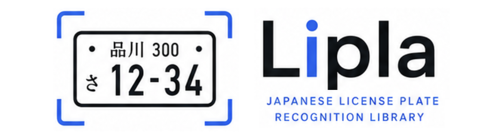
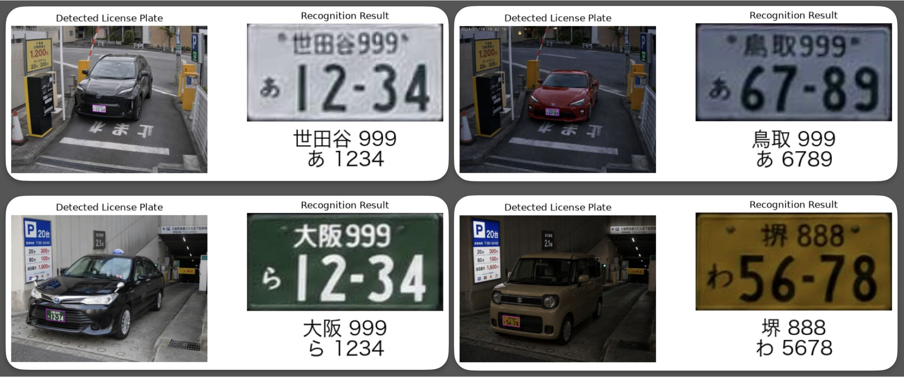

<div align="center">

</div>

<p align="center"><a href="https://github.com/ikeboo/Lipla-jp"></a> <a href="https://huggingface.co/bukuroo/Lipla-jp"></a> <a href="https://huggingface.co/spaces/bukuroo/Lipla"></a> <a href="https://colab.research.google.com/drive/1YUG36Q8kpGtsolwp0ZfqqitfIhmMBZ1E?usp=sharing"></a> <a href="LICENSE"></a></p>

<div align="center">

</div>

### 🖐️ What's Lipla?
日本の自動車ナンバープレート認識用Pythonライブラリ。  
高精度、オープンソース、商用利用可能。

### ⚡️ Quick Start
- セットアップ  
    ```sh
    pip install git+https://github.com/ikeboo/Lipla-jp.git
    ```

- 検出実行  
  初回のみ[モデルウェイト](https://huggingface.co/bukuroo/Lipla-jp)が自動ダウンロードされます。
    ```python
    import lipla

    rec = lipla.Recognizer()
    results = rec("samples/00.jpg") # パスまたはcv2image
    ```
- 出力データの詳細
    ```python
    result = results[0]  # 複数の検出結果が格納されています
    result.area          # 世田谷
    result.class_number  # 999
    result.kana          # あ
    result.number        # 1234
    result.plate_image   # 正規化したプレート画像
    result.original_image  # 入力元画像
    result.det_image     # 検出領域を描画した元画像
    result.result_image  # 正規化画像と認識結果の表示画像
    result.visualize()   # 検出画像と認識結果を並べて表示
    ```

### 🧠 Features
- MIT-licenseで商用利用、再配布可能。  
- 2026年時点で最新の検出、OCRモデルを利用した高精度な認識を実現。  

    |タスク|モデル名|
    |----|----|
    |プレート検出|EdgeCrafter Pose|
    |OCR|PPOCRv6 medium|
- ONNXベースのライブラリ、PyTorch依存なし

### 📄 License
このプロジェクトは[MIT License](LICENSE)のもとで公開されています。

### 🙏 Acknowledgements
このプロジェクトでは、以下のオープンソースプロジェクトを利用しています。

- [EdgeCrafter](https://github.com/Intellindust-AI-Lab/EdgeCrafter)
- [PaddleOCR](https://github.com/PADDLEPADDLE/PADDLEOCR)
